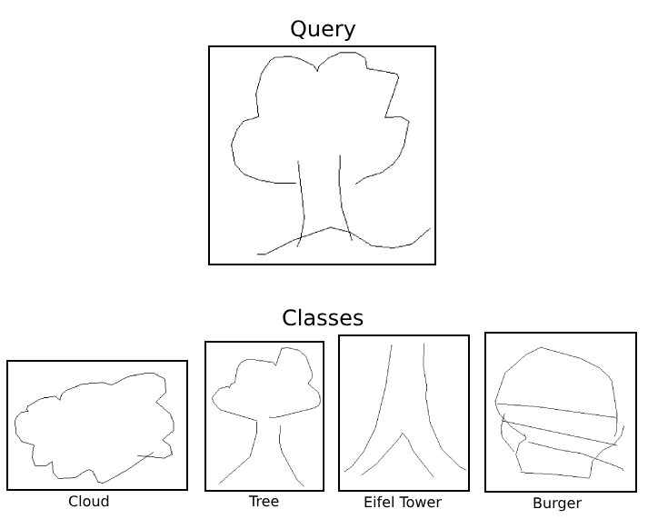
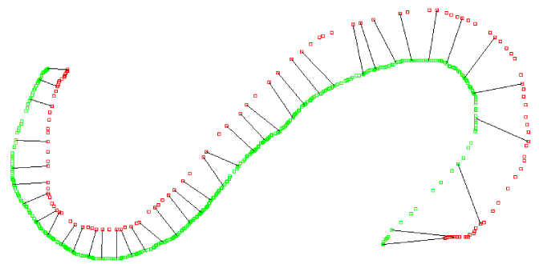

# 📷 Image classifier by Dynamic Time Warping


<div style="display: flex; justify-content: space-around; align-items: center;">
  
</div>

Image classifier for [ppm images](https://fr.wikipedia.org/wiki/Portable_pixmap).

To find the nearest neighbour for the query, the tool implements a bounded priority queue processing the given images from the training data set. The nearest neighbour class is the guess for the query.

Project carried out in the context of the Data structures and Algorithm course "INFO0902" given by Pr. Geurts, University of Liège.

Grade : 19/20

To determine the best fit for the query, the algorithm used is [Dynamic time warping](https://en.wikipedia.org/wiki/Dynamic_time_warping)

<div style="display: flex; justify-content: space-around; align-items: center;">
  
</div>

The training and test sets come from the [Google QuickDraw dataset](https://github.com/googlecreativelab/quickdraw-dataset).

<div style="display: flex; justify-content: space-around; align-items: center;">
  
</div>

## Summary
1. [Try it!](#try-it)
2. [Data sets format](#data-sets-format)
3. [Credits](#credits)

## Try it!

Compile the tool
```console
make
```

### Classify one image
To classify one image from `testset.txt`, run :
```console
./NNSketch -i index -k k -o ./results trainingset.txt testset.txt
```

Where :
- `index` is the index of the image in `testset.txt`.
- `k` is the number of images from `trainingset.txt` to use for the classification.

Example :
```console
./NNSketch -i 1 -k 200 -o ./results trainingset.txt testset.txt
```

Note : the image selected to be classified is visible in `./results`

### Evaluate the DTW performances

To test ²the algorithm on all the test set, run :
```console
./NNSketch trainingset.txt testset.txt
```

## Data sets format

The two data sets have the same structure :

`number of images`

`first image`
- `class`
- `number of pixels`
- `pixels`

`...`

`last image`


## Credits
- Simon Gardier (Co-author)
- Lei Yang (Co-author)

